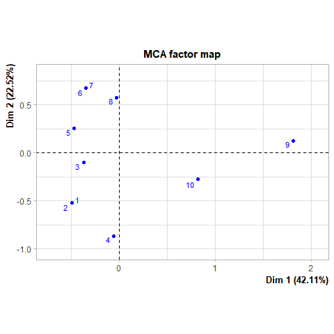
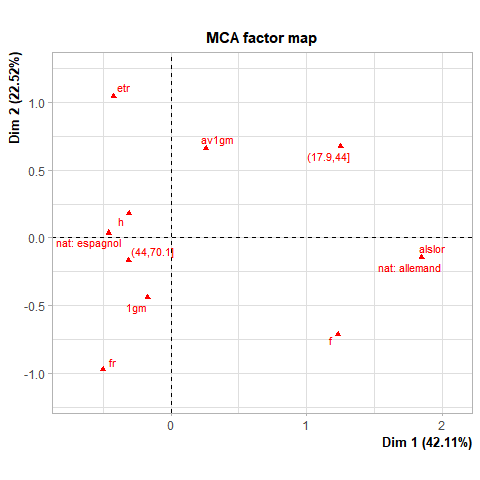
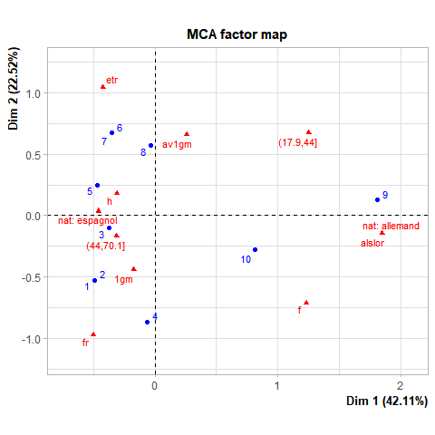
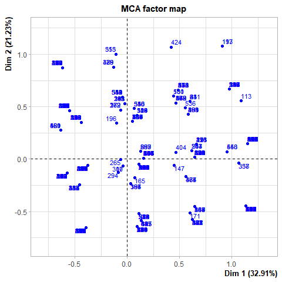
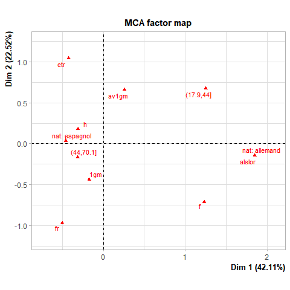
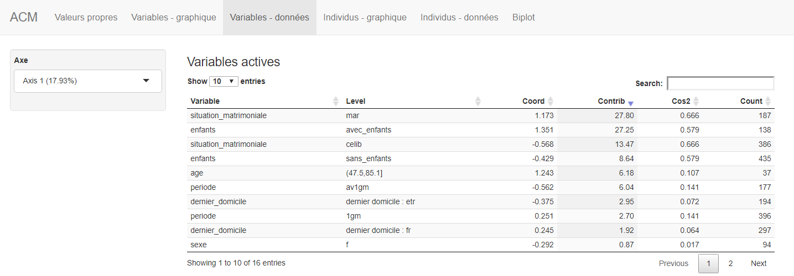
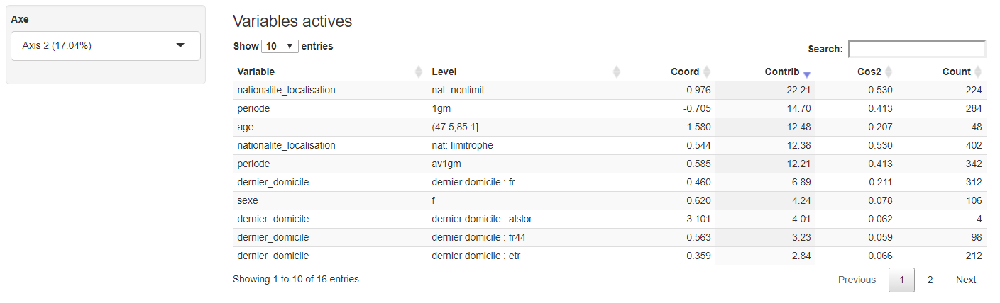

Introduction à l’analyse en composantes multiples
================

L’ACM consiste à synthétiser de manière géométrique, à l’aide de nuages
de points, des tableaux présentant, en ligne, des individus décrits en
colonne par des variables qualitatives, c’est-à-dire des informations
sur ces individus qui ne prennent qu’un nombre limité de valeurs
appelées des modalités.

# Exemple introductif

## Exemple de tableau brut

:bulb: Il faut bien distinguer :

  - Une variable qualitative. Exemple : période chronologique.
  - Une modalité (ou valeur). Exemple : première guerre mondiale.

<!-- end list -->

    ## # A tibble: 10 x 6
    ##    id_individu nationalite_localisation periode sexe  age       dernier_domicile
    ##          <dbl> <fct>                    <fct>   <fct> <fct>     <fct>           
    ##  1           1 nat: espagnol            1gm     h     (44,70.1] fr              
    ##  2           2 nat: espagnol            1gm     h     (44,70.1] fr              
    ##  3           3 nat: espagnol            av1gm   h     (44,70.1] fr              
    ##  4           4 nat: espagnol            1gm     f     (44,70.1] fr              
    ##  5           5 nat: espagnol            1gm     h     (44,70.1] etr             
    ##  6           6 nat: espagnol            av1gm   h     (44,70.1] etr             
    ##  7           7 nat: espagnol            av1gm   h     (44,70.1] etr             
    ##  8           8 nat: espagnol            1gm     h     (17.9,44] etr             
    ##  9           9 nat: allemand            av1gm   f     (17.9,44] alslor          
    ## 10          10 nat: allemand            1gm     h     (44,70.1] alslor

## Interpétation

L’ACM débute par l’étude des individus puis l’études des variables.

### Etude des individus

``` r
plot(res, invisible=c("var","quali.sup"), cex=0.7)
```

<!-- -->

L’ACM vise à étudier la variablilité des individus. Est ce que des
indivus se ressemblent (individus possédant de nombreux modalités en
commun) ? Est ce que des individus sont différents (individus avec peu
de modalités en commun) ? L’ensemble des ressemblances / différences
entre les individus est appelée la variabilité des individus. Si tous
les individus sont similaires l’analyse est inutile.

  - Si deux individus prennent les mêmes modalités, la distance sur le
    plan est de 0 et les points se confondent.
  - Si deux individus prennent une majorité de modalités en commun, la
    distance qui les sépare est petite.
  - Si deux individus prennent les même modalités sauf un qui possède
    une modalité rare, la distance est grande.
  - Si deux individus ont en commun une modalité rare, la distance qui
    les sépare est petite.
  - Un individu est d’autant plus loin de l’origine qu’il possède des
    modalités rares.
  - Un individu proche de l’origine qu’il possède des modalités
    fréquentes.

### Etudes des variables

``` r
plot(res, invisible=c("ind","quali.sup"), autoLab="y", cex=0.7)
```

<!-- -->

Les modalités proches du centre sont les plus fréquentes, les modalités
les plus éloignées sont les plus rares. Les modalités proches les unes
des autres sont corrélées.

## Biplot

``` r
plot(res, cex=0.7)
```

<!-- -->

# Analyse à partir d’un tableau brut réel

## Préparations des données

### La préparation des données vise à construire un tableau dans lequel :

  - Le nombre des modalités des variables qualitatives est réduit à
    quelques modalités (elle sont souvent dichotomées).
  - Les variables quantitatives sont discrétisées comme par exemple les
    âges transformés en classes d’âges.
  - Les lignes comportant des valeurs absentes ou aberrantes sont
    filtrées.

## L’ACM dans R

  - Vous utiliserez l’IDE RStudio. Vous devez créer un nouveau projet
    (panneau *project*) appelé `acm_etr` pour gérer la résolution du
    chemin de lecture du fichier de données `etr_acm.csv`
  - vous téléchargerez le fichier `etr_acm.csv` dans votre dossier de
    projet.
  - Le programme fait appel aux packages `FactoMineR`, `explor`, `dplyr`
    et `readr`qui doivent être installés au préalable. Vous devez donc
    vérifiez leur présence et les installer le cas échéant (panneau
    *packages* de RStudio).
  - La première partie du programme charge les packages à l’aide de la
    fonction `library`. Le fichier de données au format csv est lu à
    partir du répertoire de travail.
  - Une ultime préparation des données est ensuite réalisée
    (dédoublonnage des individus, discrétisages des âges en deux
    groupes)
  - L’ACM est ensuite réalisée.
  - L’exploration visuelle s’effectue enfin à l’aide des fonctions
    `View` et `explor`.

<!-- end list -->

``` r
#
library(FactoMineR)                       
library(explor)                            
library(dplyr)                           
library(readr)                            

# 
dataset_acm0 <- read_csv("etr_acm.csv")   

#  
dataset_acm1 <- dataset_acm0 %>%
  distinct(nom_nat, .keep_all = TRUE) %>% 
  mutate(age=cut(age, 2))                  
# 
acm1 <- MCA(dataset_acm1[-c(1:4)], graph = FALSE)         
```

``` r
View(dataset_acm1)
explor(acm1) 
```

## Interprétation

### Individus

``` r
plot(acm1, invisible=c("var","quali.sup"), cex=0.7)
```

<!-- -->

### Modalité et construction des axes

``` r
plot(acm1, invisible=c("ind","quali.sup"), autoLab="y", cex=0.7)
```

<!-- -->

Le repère, appelé plan factoriel est construit par un axe 1 (horizontal)
et un axe 2 (vertical). Les axes traduisent des oppositions de
modalités. L’ analyse des contributions des modalités actives montre
que le premier axe oppose dans l’ensemble les individus mariés aux
non-mariés, les individus agés de 38 à 58 ans sont biens représentés du
côté positif de l’axe 1. Ils ont par ailleurs plus de chance d’être
mariés et d’avoir des enfants.

Le deuxième facteur, représenté par l’axe des ordonnées, oppose plutôt
deux catégories : les nationalités limitrophes et non-limitrophes.

:bulb: On relève les deux premières variables de chaque axe pour
traduire les principales oppositions.

 

# Références

<https://quanti.hypotheses.org/930>
