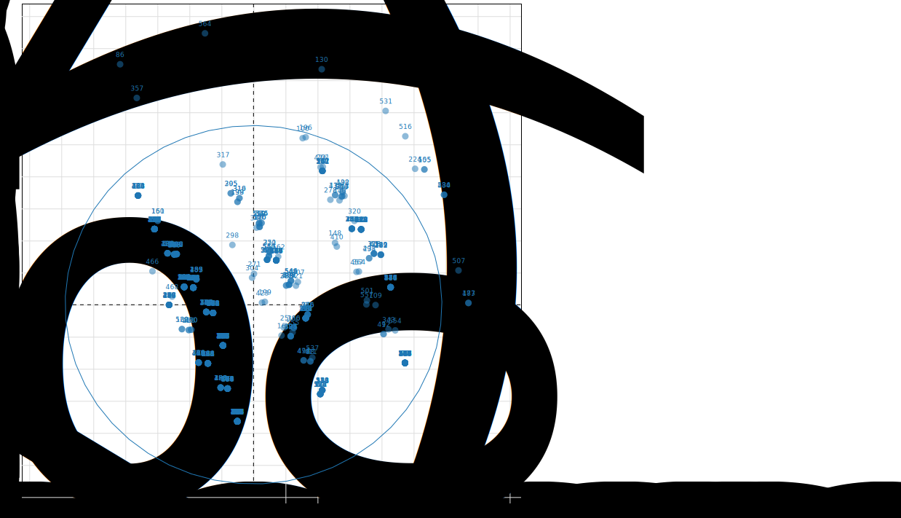
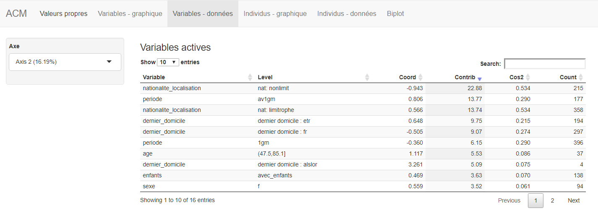

Analyse en composantes multiples
================

# Introduction à l’ACM

## Sur quelles données porte une ACM ?

L’ACM consiste à synthétiser de manière géométrique à l’aide de nuages
de points des tableaux présentant, en ligne, des individus décrits en
colonne par des variables qualitatives, c’est-à-dire des informations
sur ces individus qui ne prennent qu’un nombre limité de valeurs
appelées des modalités.

Il faut bien distinguer : \* Une variable qualitative : exemple : statut
matrimominal. \* Une modalité (ou valeur): ex : célibataire.

## Transformées en TDC…

L’ACM va reposer sur une déclinaison du tableau brut que l’on appelle
tableau dijonctif complet. Dans le tableau disjonctif complet les lignes
sont les individus et les colonnes les modalités des variables. Lorsque
qu’un individu possède la modalité de la variable on va trouver la
valeur 1 et s’il ne la possède pas, 0. L’utilisateur ne construit et ne
visualise jamais le tableau disjonctif complet. C’est une opération
transparente.

## Objectifs

L’ACM débute par l’étude des individus puis l’études des variables.

### Etude des individus

L’ACM vise à étudier la variablilité des individus. Est ce que des
indivus se ressemblent (indivdus possédant de nombreux modalités en
commun) ? Est ce que des indivus sont différents (indivus avec peu de
modalités en commun) ? L’ensemble des ressemblances / différences entre
les individus est appelée la variabilité des individus.Si tous les
individus sont similaires : l’analyse est inutile.

### Etudes des variables

#### Liaison des variables

La liaison entre deux variables qualitatives s’étudie au travers des
associations entre leurs modalités. Par exemple, les variables statut
matrimonial et enfants sont liées : les personnes qui sont mariées ont
plutôt des enfants.

## Préparations des données

La préparation des données vise à construire un tableau dans lequel : -
variables qualitatives : le nombre des modalités est réduit à quelques
modalités. - variables quantitatives discrétisées (ex :âge en classes
d’âges). - individus : les lignes comportant des valeurs absentes ou
aberrantes sont filtrées.

## L’ACM dans R

``` r
# Packages
library(FactoMineR)                        # analyse exploratoire des donnees multivariées
library(explor)                            # visualisation interactive de l'ACM
library(dplyr)                             # manipulation des  données
library(readr)                             # lecture des fichiers csv

dataset_acm0 <- read_csv("etr_acm.csv")    # lecture du fichier etr_acm.csv

# Préparation des données 
dataset_acm1 <- dataset_acm0 %>%
  distinct(nom_nat, .keep_all = TRUE) %>%  # supression des doublons
  mutate(age=cut(age, 2)) %>%              # la variable age est discrétisée en deux intervalles égaux
  select(-prof_manoeuvre)                  # la variable manoeuvre est exclue de l'ACM. 

# visualisation du tableau brut 
View(dataset_acm1)

# ACM
acm1 <- MCA(dataset_acm1[-c(1:4)])         # acm (avec exclusion des variables 1 à 4).

# Visualisation interactive
explor(acm1)                               # visualisation interactive de l'ACM
```

## Interprétation

### Individus



  - Si deux individus prennent les mêmes modalités : distance = 0.
  - Si deux individus prennent une majorité de modalités en commun :
    distance = petite.
  - Si deux individus prennent les même modalités sauf un qui possède
    une rare : distance grande.
  - Si deux individus ont en commun une modalité rare : distante petite.
  - Un individu est d’autant plus loin de l’origine qu’il possède des
    modalités rares.
  - Un individu proche de l’origine possède des modalités fréquentes.

## Modalités

### Modalité et origine des axes


les modalités proches du centre sont les plus fréquentes, les modalités
les plus éloignées sont les plus rares. Les modalités proches traduisent
des associations.

### Modalité et construction des axes

Le repère, appelé plan factoriel est construit par un axe 1 (horizontal)
et un axe 2 (vertical). Les axes traduisent des oppositions de
modalités.

situation\_matrimoniale mar 1.173 27.80 0.666 187 enfants avec\_enfants
1.351 27.25 0.579 138

La modalité « mar » de la variable “situation\_matrimoniale” se situe du
côté positif de l’axe 1 (coordonnée positive), les individus mariés sont
donc biens représentés du côté positif de l’axe 1. Ils ont par ailleurs
plus de chance d’avoir comme modalité « avec enfants » de la variable
“enfants”.

 
